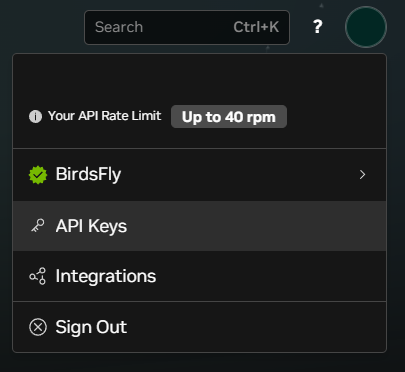
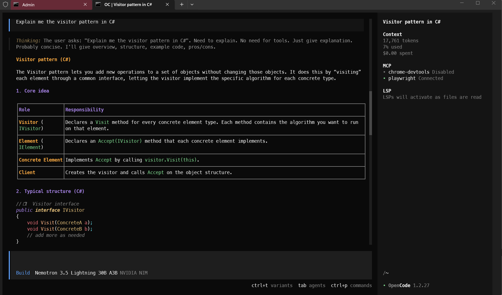

# How to wire OpenCode with the free inference API of NVidia
You can benefit from the free inference API of NVidia. They provide a lot of models and decent speed. Obviously do not use it for sensitive or personal information. But this is a great opportunity for opensource work, to play with agents, test skills, etc. at no cost.

## Step 1 - Create a NVidia NIM account
- Navigate to https://build.nvidia.com/models
- Sign-up
- In the upper-right corner, select the profile then "API keys".
- Generate an API key and keep the value

The API key looks like "nvapi-x-xxxxxxxxx..."

<p align="left">
  
</p>

## Step 2 - Install OpenCode 
Can be skipped of course if that's already in place. It is one of the best opensource harness and is lighter than Claude, Codex or Copilot.
Another good option is Pi but configuration is different and not covered here.

Easiest way to install OpenCode is through npm. Refer to https://opencode.ai/download for other methods.

```bash
npm i -g opencode-ai
```

## Step 3 - Configure OpenCode

- Navigate to your .opencode folder (in Windows, usually in %USERPROFILE%/.opencode).
- Adapt the JSON to add the "nvidia" section under "provider".
- Replace the apiKey property with your NVidia API key.

```json
{
    "$schema": "https://opencode.ai/config.json",
    "provider": {
        "nvidia": {
            "npm": "@ai-sdk/openai-compatible",
            "name": "NVIDIA NIM",
            "options": {
                "baseURL": "https://integrate.api.nvidia.com/v1",
                "apiKey": "nvapi-b-xxxxxxxxxxxxxxxxxxxxxxxxxxxxxxxx"
            }
        }
    }
}
```

## Step 4 - Use it
Start OpenCode, then change the model with /models.

You should have a category called "NVIDIA NIM". The list is constantly evolving and the resources allocated to each model may vary.
The NVidia models (Nemotron) have normally a good speed and decent quality of service. This may not be the case for other heavier or trendy models.
Here I pick "nemotron-3.5-lightning-30b-a3b" which is a small mixture-of-experts model (MoE) but capable for light tasks.

The token generation speed is excellent (at least with this small model) and comparable to what you would get if you were chatting with ChatGPT.

<p align="left">
  
</p>